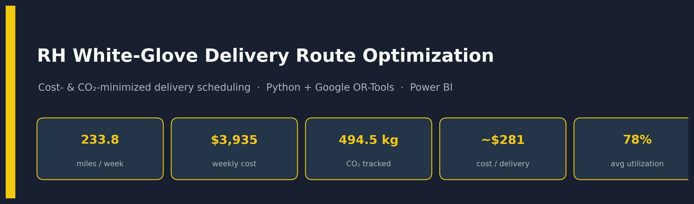
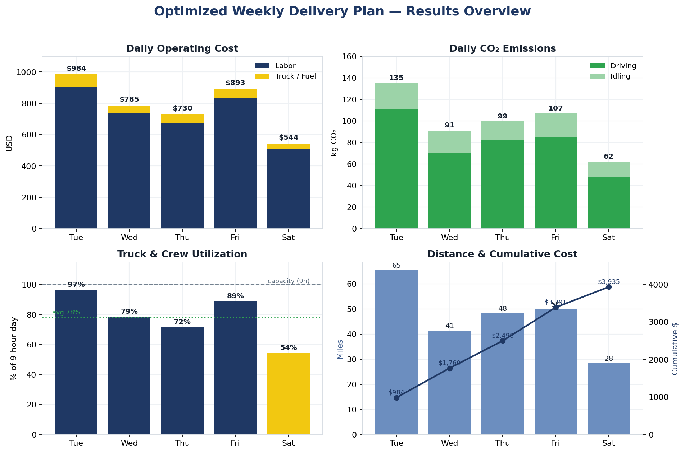
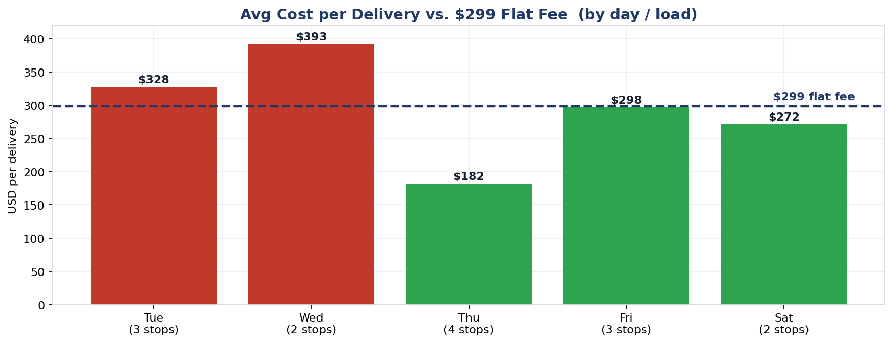
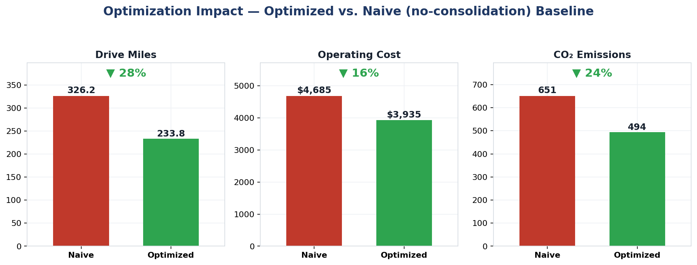

# 🚚 RH White-Glove Delivery Route Optimization

> An end-to-end analytics pipeline that minimizes **operational cost** and **CO₂ emissions** for Restoration Hardware's premium "White Glove" furniture delivery — from raw customer orders to an interactive Power BI operations dashboard with a live, disruption-ready replanning loop.


---

## 📌 Problem

RH operates premium White-Glove furniture delivery (expert assembly, damage-free handling, in-home placement) out of a single distribution center with **one truck and one crew**. Deliveries must land inside an **8:00 AM – 5:00 PM** window, **Tuesday–Saturday**, while respecting vehicle capacity, labor, and fuel constraints.

Last-mile delivery is the single largest cost component in the chain — **53%+ of total shipping cost** — and road freight is one of the fastest-growing sources of CO₂. Every mile shaved is **both money saved and carbon avoided**. The challenge: turn a list of customer orders into a daily route, loading plan, and schedule that is provably cheaper and greener than naive scheduling — and keep it accurate when the real world goes sideways.

## 🎯 Objective

Build three integrated deliverables:

1. **Optimization model** — a cost- and emissions-aware daily delivery schedule.
2. **Power BI dashboard** — the operational tool for the warehouse manager and driver (route, loading manifest, schedule, cost, CO₂).
3. **Dynamic input pipeline** — a template that, when edited, triggers re-optimization and a dashboard refresh — robust enough to absorb real operational disruptions.

---

## 🏗️ Solution Architecture

```mermaid
flowchart LR
    A[Customer Orders CSV<br/>+ Address Book] --> B[Data Cleaning &<br/>ID Standardization]
    B --> C[Geocoding<br/>geopy → lat/long]
    C --> D[Distance & Time<br/>Matrix]
    D --> E[Capacity & Oversized<br/>Order Screening]
    E --> F[OR-Tools VRP Solver<br/>route + sequence]
    F --> G[Multi-Day Scheduler<br/>8AM–5PM · Tue–Sat]
    G --> H[Cost & CO₂ Engine<br/>labor · fuel · idle]
    H --> I[(Clean CSV Exports)]
    I --> J[Power BI Dashboard<br/>route · manifest · cost · CO₂]
    K[Input_Config Template] -->|edit triggers replan| E
    J -->|operational feedback| K
```



**Pipeline stages**
- **Clean & match** customer orders to the address book and standardize IDs.
- **Geocode** every delivery address to coordinates (with manual resolution of un-geocodable addresses).
- **Build distance/time matrices** from the warehouse and between stops.
- **Screen capacity** — flag oversized orders that a single truck cannot carry.
- **Solve the route** with **Google OR-Tools** (Vehicle Routing Problem, path-cheapest-arc) per day.
- **Schedule day by day** until every order is fulfilled, respecting the delivery window and loading/transit/service times.
- **Cost the plan** — labor, truck/fuel, and CO₂ (driving + idling) using EPA emission factors.
- **Export** clean tables that feed the Power BI dashboard.

---

## 📊 Results (Assigned Dataset — Team 8)

A full week of deliveries optimized into an efficient, low-carbon schedule:

| Metric | Result |
|---|---:|
| Delivery days | **5** (Tue–Sat) |
| Customer deliveries | **14** across **6** trips |
| Total distance | **233.8 miles** |
| Total operating cost (labor + truck/fuel) | **$3,934.83** |
| Total CO₂ emitted | **494.5 kg** |
| Average cost per delivery | **≈ $281** |
| Average truck/crew utilization | **78%** (peak **96.7%**) |

**Emission factors used:** 1.69 kg CO₂/mile (medium-duty box truck) · 3.97 kg CO₂/hr idling (EPA diesel) · labor $104/hr · truck $1.205/mile.



*Daily operating cost (labor + truck/fuel), CO₂ split into driving vs. idling, truck/crew utilization against the 9-hour capacity ceiling, and distance vs. cumulative cost — all computed by the optimization pipeline.*

### 💡 Business insight — should RH revisit the $299 flat fee?
The optimized model puts the **average delivery cost at ≈$281**, leaving a thin and **highly variable** margin against the **$299** flat rate — compact, short-route orders cost as little as ~$80, while heavy, multi-room deliveries exceed $200+ in labor and staging alone. The recommendation (see [`docs/`](docs/Management_Recommendation_Memo.docx)): **keep $299 as the base and add a $349 premium tier** for high-complexity deliveries, protecting margin without eroding RH's curated-luxury brand positioning.



---

## 🌱 Optimization Impact — vs. a Naive Baseline

To quantify the value of the model, the optimized plan is compared against a **naive no-consolidation baseline** — one dedicated round trip per order, with **no batching and no route sequencing** — costed with the *exact same* labor, fuel, and CO₂ model and identical service times, so the only difference is routing efficiency.

| Metric | Naive baseline | Optimized | Reduction |
|---|---:|---:|---:|
| Drive miles / week | 326.2 | **233.8** | **−28%** |
| Operating cost / week | $4,685 | **$3,935** | **−16%** (≈ **$39,000/yr**) |
| CO₂ emissions / week | 650.6 kg | **494.5 kg** | **−24%** (≈ **8.1 tonnes/yr**) |

> Consolidating **14 single-stop trips into 6 optimized multi-stop routes** removes ~92 miles and ~156 kg CO₂ every week — turning an operational tweak into a measurable **ESG + margin** win.



---

## 🔁 Dynamic Replanning & Disruption Handling

The pipeline isn't a one-shot batch job — it's built to **re-plan when reality changes**. The `Input_Config` template drives constraints (capacity, vehicle count, work window, daily mileage cap); editing it re-runs the optimization and refreshes the dashboard. The design accommodates real operational disruptions, e.g.:

- **Customer not available** → skip the stop, resequence the remaining route, reschedule the customer for a later day.
- **Partial order cancellation** → update the loading manifest, free truck capacity, pull a later delivery forward, regenerate the route.
- **Vehicle breakdown** → dispatch a rescue truck, transfer the load, recompute arrival windows, and add the rescue trip's incremental cost and CO₂.

---

## 🧰 Tech Stack

| Layer | Tools |
|---|---|
| Language | Python (pandas, numpy) |
| Geocoding | geopy |
| Optimization | Google OR-Tools (VRP routing) |
| Reporting / BI | Microsoft Power BI |
| Input template | Excel (`Input_Config.xlsx`) |
| Environment | Jupyter / Google Colab |

---

## 📁 Repository Structure

```
rh-white-glove-route-optimization/
├── README.md
├── requirements.txt
├── LICENSE
├── notebooks/
│   └── RH_Route_Optimization.ipynb     # End-to-end pipeline: clean → geocode → VRP → cost/CO₂ → export
├── data/
│   └── RH_Customer_Orders_Dataset_8.csv
├── dashboard/
│   ├── RH_Delivery_Dashboard.pbix      # Power BI operations dashboard
│   └── screenshots/                    # Dashboard images (add PNGs here)
├── templates/
│   └── Input_Config.xlsx               # Dynamic input that drives re-optimization
└── docs/
    └── Management_Recommendation_Memo.docx
```

---

## ▶️ How to Run

```bash
# 1. Install dependencies
pip install -r requirements.txt

# 2. Open the notebook (Jupyter or Google Colab recommended for speed)
jupyter notebook notebooks/RH_Route_Optimization.ipynb

# 3. Run all cells — the pipeline geocodes addresses, solves the routes,
#    computes cost & CO₂, and exports the CSVs consumed by Power BI.

# 4. Open dashboard/RH_Delivery_Dashboard.pbix in Power BI Desktop
#    and refresh to load the latest optimized plan.
```

> **Note on geocoding:** the notebook caches geocoded coordinates so reruns are fast and don't hammer the geocoding service — pull once, validate, then iterate.

---

## 📷 Dashboard Preview

Screenshots of the Power BI report (route map, loading manifest, cost & CO₂ panels) live in [`dashboard/screenshots/`](dashboard/screenshots/). *(Add your exported PNGs there and they'll render here.)*

---

## 👤 Author

**Valentine Dube** — M.S. Business Analytics, Hult International Business School
📍 Boston, MA · [LinkedIn](https://www.linkedin.com/in/valentine-dube) · [GitHub](https://github.com/ValentineDube)

*Completed as a graduate analytics team project (RH summer-intern case, Team 8). This repository presents the analytical pipeline, optimization model, and dashboard architecture.*

## 📄 License

Released under the [MIT License](LICENSE).
